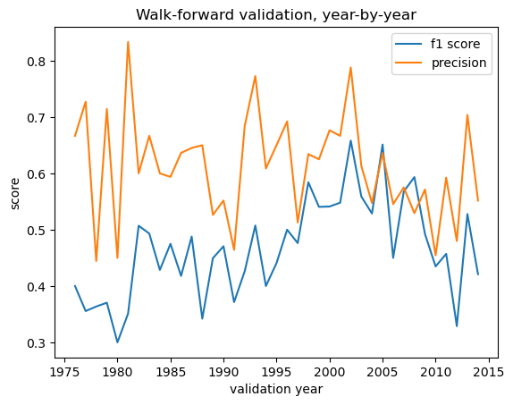
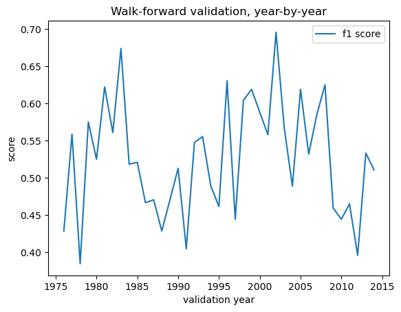
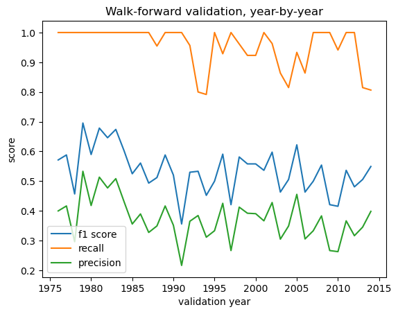
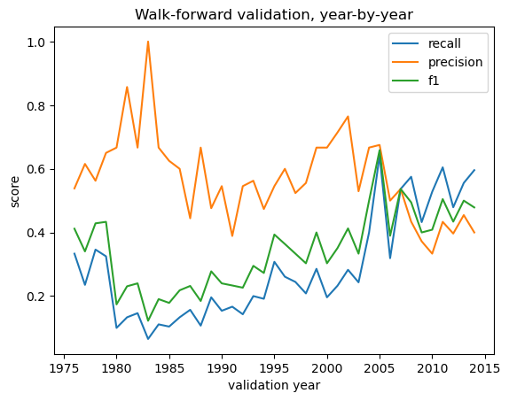
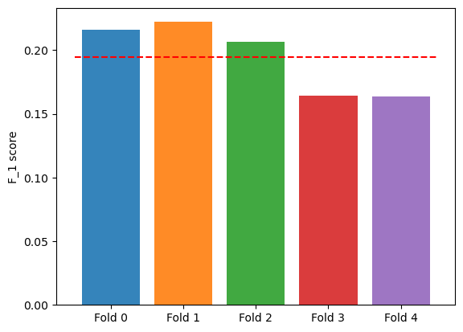

# Modeling summary

This notebook summarizes the various attempts we've made to modeling, including models that we believe did not perform well. 

All in all we've attempted the following:
- SVM classifier
- XGB classifier
- XGB ranker
- XGB ranker with encoded synopsis data
- Logistic regression
- Logistic regression with automated tagging features
- Logistic regression with encoded synopsis data
- LightGBM ranker model
- Various ensemble methods on the encoded synopsis data

We will summarize the results of our model testing below.

### SVM models
SVM models of various types were tested with various feature engineering done to compare performance. Using walkforward cross-validation, the mean $F_1$ scores of the various scenarios tested were around $0.3$ and the metrics for this model was worse than XGB classifier across the board, therefore this model was discarded.

### XGB classifier
The mean $F_1$ score of the XGB classifier model using walkforward cross-validation was $0.467$. The $F_1$ score by year during walkforward cross validation is recorded in the following graph.

We see that this model performs decently well, though we believe it could be improved.

### XGB ranker
This model's average $F_1$ score across walkforward cross-validation folds was $0.527$. The $F_1$ score across cross validation folds is the following.

The graph is more chaotic, but tends to do better than XGB classifier. It turns out that this is one of the best performing models, which we choose as one of our final models.

### XGB ranker with encoded synopsis data
This is an modification of the XGB ranker model above with the incorporation of the encoded synopsis data. In this model, we first apply a $k$-nearest neighbor classifier model on the encoded synopsis point cloud, then we plug in the prediction of the KNN model into the XGB ranker model as an extra feature. 

In testing this model, we found that it does not perform very well when we have missing entries, achieving a mean $F_1$ score of only $0.316$ in cross validation. However, once we drop all entries with missing fields during training and testing, we find that model performs much better, achieving a mean $F_1$ score during cross validation of $0.537$. The graph is shown below.

So after dropping all entries with missing fields, we believe this model's performance is good enough to justify being one of our final models.

### Logistic regression
We trained a logistic regression model as a more advanced baseline model to compare our results against. Using cross validation to optimize the threshold, we have the following graph for $F_1$ scores during cross-validation.

### Logistic regression with automated tagging features
Using the same sentence transformer model that we used with the book synopses, we can encode the tags and take the similarity of the encoded synopses against the encoded tags to create an automated tagging system for our books. We can then plug the tag similarities into a logistic regression model. 

However, doing a simple train/test split of our training set (books before 2006 and books from 2016--2014), we find that the logistics regression model with the auto-generated tags and number of previous awards by author features actually performed *worse* than the logistics regression model with just the number of previous awards as a features ($F_1$ scores of 0.396 vs 0.329). This justifies excluded the auto-generated tags as a feature.

### Logistics regression with synopses
In this model, we incorporated the encoded synopsis vectors as an additional feature into the logistics regression model. Here, we used a coarser walk-forward validaton (the testing was done before the year-by-year walkforward script was created), where we manually split the training data into 5 folds.
- Fold 0: training years 1971--1977, validation years 1978--1979
- Fold 1: training years 1971--1985, validation years 1986--1987
- Fold 2: training years 1971--1993, validation years 1994--1995
- Fold 3: training years 1971--2001, validation years 2002--2003
- Fold 4: training years 1971--2011, valdiation years 2012--2014

This model produced an average $F_1$ across folds of $0.19$, and the $F_1$ scores across folds is recorded in the following table, where the red dashed line indicates the average $F_1$ score.

We see here that the $F_1$ scores are not very high, which meant that we excluded this model from consideration.

### LightGBM model
