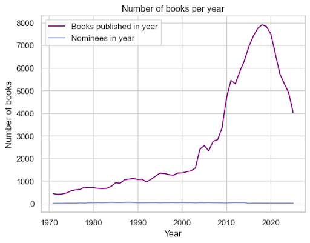
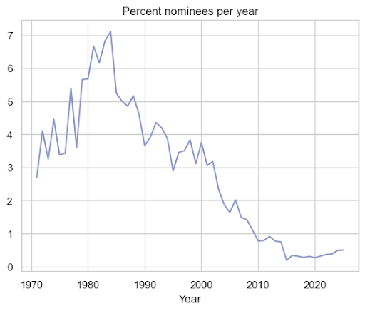
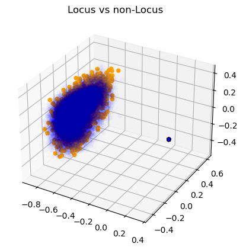
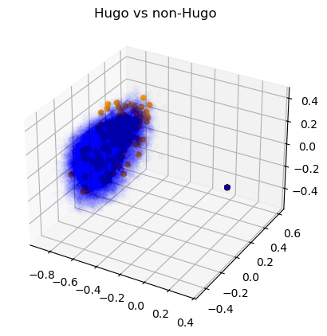
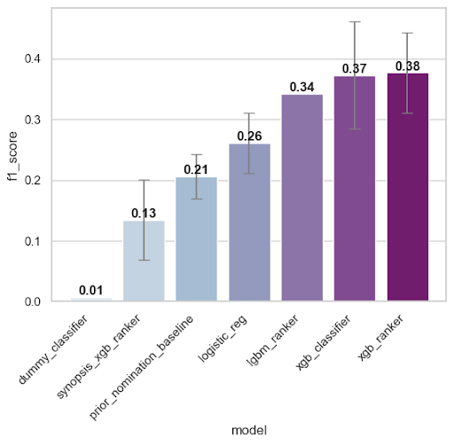
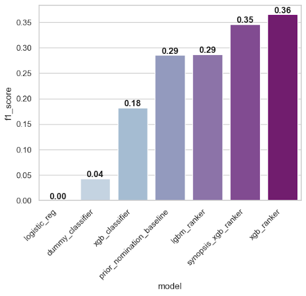
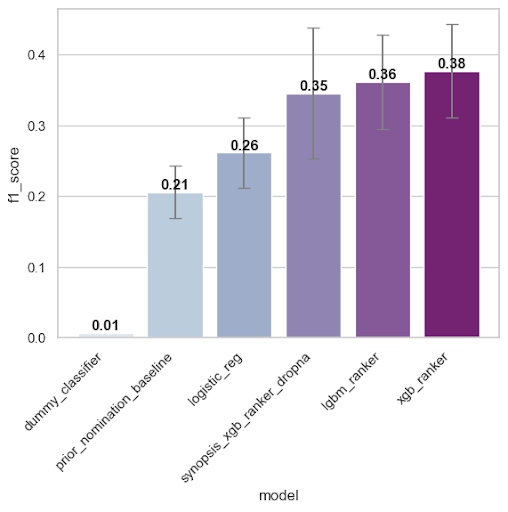
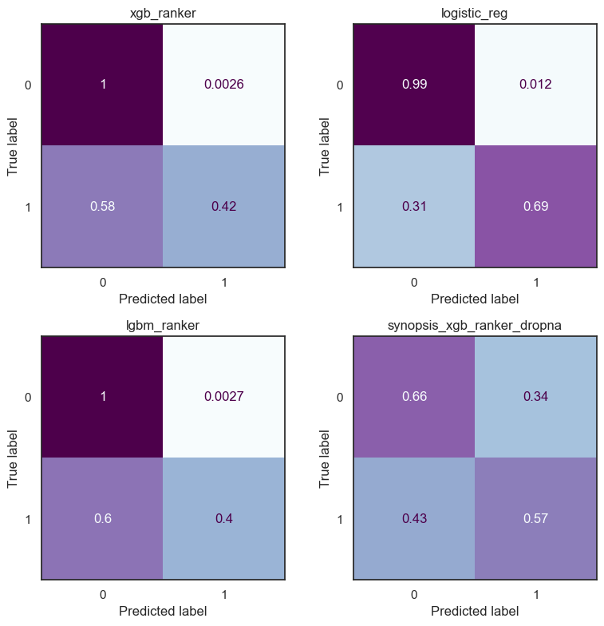

# summer26-nomination-worthy-books
## What is nomination worthy? Predicting the success of newly-released fantasy & sci-fi novels
### Team: Yilda Boukhtouchen, Annika Christiansen, Xingyu Cheng, Jay Desai, Qisi Zhang

### Introduction
This project aims to predict the future success of newly-released novels within the SFF (science-fiction and fantasy) genres. In particular, the project focus on predicting if a given new release will be nominated for a prestigious SFF book award: the Hugo Awards and Locus Awards.

### Dependencies
This project relies on the following dependencies to run:
- ```sentence_transformer```
```
pip install -U sentence_transformer
conda install sentence_transformer
```
- ```pattern```
```
pip install pattern
conda install pattern
```
- others...

### Stakeholders and KPIs
Our main stakeholders are publishers, editors, authors, booksellers, libraries, SFF readers and award communities. These groups can use the project to identify promising new SFF novels, understand the factors linked to award nominations, and improve marketing decisions. 

We define the following key performance indicators (KPI):
- $F_1$ score
- In the case of ranker models ```precision@k``` and ```ndcg@k```, with ```k``` in ```[5, 10, 15, 20]```.

We compare our models across these KPIs with the following naive baseline models:
- A stratified DummyClassifier 
- A baseline model which predicts that all novels written by a previously-nominated author will be nominated again.
- A simple logistics regression model.

### Data Collection and Processing
The raw data was collected from the following sources:
- International Speculative Fiction Database (ISFDB), a community-built database of science-fiction, fantasy and horror books. This is accessible through a SQL data dump and contains metadata for books.
- Hardcover, a free reading tracking social platform, queried through its free API. This was used to supplement the ISFDB database to acquire book descriptions and subject/genre tags.
- Science Fiction Awards Database (SFADB), an index of science fiction and fantasy awards. This was used to acquire the list of all yearly nominees for Hugo Award for Best Novel and Locus Awards for Best (Fantasy, Sci-Fi) Novel.

The ISFDB database was queried against award eligibility criteria using MySQL, then combined with the Hardcover and award-nominee datasets using Pandas. The data was subsequently cleaned using Pandas.

### Model and Data Features
The first thing one notices about the data is that there is a massive class imbalance as one should expect. The class imbalance gets worse for later years because the number of books that get published increases each year. This means that we need to select our metrics and models with this inherent class balance in mind.

  

Our model features, and feature engineering could be summarized in the following table.
|                     | Features                                                                        | Processing                                                      |
| ---------------------| ---------------------------------------------------------------------------------| -----------------------------------------------------------------|
| Author metrics      | previously nominated (boolean feature), past nomination count, past novel count | z-score normalization compared to year cohort                   |
| Publisher prestige  | past nomination count, cohort size (number of books published that year)        | z-score normalization compared to year cohort                   |
| Publication details | First publisher, publication month                                              | One-hot encoding                                                |
| Genre similarity    | Cohort similarity, past-nominee similarity                                      | Cosine similarity in tag vector space                           |
| Book synopsis data  | Text of book description/synopsis from databases                                | Encoded as vectors using the pretrained model all-MiniLM-L6-v2. |

For the book synopsis data, the transformer encodes them as vectors in a 384-dimensional vector space. We can visualize them by taking 3D slices using PCA (note the dark dot, which represents all the null values getting sent to 0).

  

Some simple hypothesis testing indicates that the nominees do have a different distribution than the non-nominees, which justifies including this data as a feature in our models.

### Methods and Model
The following types of modelling were performed:
- **Binary classifier models** to predict whether or not a novel would be an award nominee. Having investigated logistic regression, decision trees, XGBClassifier, and LinearSVM in EDA, we focus on logistic regression, XGBClassifier based on their performance during cross-validation.
- **Learn to Rank models** to rank books in order of likelihood of being an award nominee. The top k nominees are then labeled as predicted nominees. We used XGBRanker and LightGBM.
- 
Our dataset spanned award years from 1971 to 2025. We performed a train-test split by year, labelling 1971 - 2014 as training years and 2015 - 2025 as test set. We employed nested walk-forward time cross-validation on the training data.

We present three baseline models to compare our results against:
- **Dummy Classifier** with stratified strategy;
- **Naive prior nomination baseline:** predict that only novels written by previously nominated authors will be nominated again;
- Standard **Logistics Regression** model.

Our final models were the XGBRanker and LightGBM (LGBM) models along with the XGBRanker with the encoded synopsis added in as a feature (SynopsisXGBRanker). For both the ‘Learn to Rank’ models used the ‘Lambda Rank’ objective with the ‘NDCG (Normalized Discounted Cumulative Gain)’ metric to be optimized. 
- **XGBRanker model:** Since (in recent years) the Locus awards has 10 finalists published for its Fantasy and Science-Fiction categories respectively, and the Hugo award has 6 finalists, the XGBRanker model will take its 26 top rankings as the predicted award nominees. 
- **LightGBM model:** This model is a Gradient boosting framework that uses decision tree based learning algorithms. It was initially implemented by Microsoft. The key difference for the LightGBM model is that in contrast to the traditional XG Boost algorithm that favors depth-wise tree growth, LightGBM favors leaf-wise (best first) tree growth. Another feature it has is that it buckets continuous features into discrete bins. The claim to fame for this model is that it has higher efficiency, faster training speeds, and lower memory usage.
- **SynopsisXGBRanker model:** This model is a modification of the above XGBRanker model with the added addition of the encoded book synopsis data. We applied a k-Nearest Neighbor (KNN) classification model on the encoded synopsis point cloud data and then plugged the KNN model’s prediction as an additional feature into the XGBRanker model. This model only performs well when we expunge all entries with missing feature entries.

### Results and Conclusions
Our final models outperformed baseline models to varying degrees.

If we evaluate our models keeping every entry, then we get the following graph to summarize the $F_1$ scores of our models compared to baseline.



We see that the XGBRanker and LGBMRanker models outperform baseline models with a $\sim 1.7 \times$ increase in $F_1$ score. However, SynopsisXGBRanker does not outperform baseline in this scenario.

If we evaluate our models after *expunging all entries with missing fields*, then we get the following graph to summarize the $F_1$ scores of our models.



In this scenario, where we presumably have the most high quality data, the XGBRanker model still performs well. We also see that the SynopsisXGBRanker model performs better than baseline, though the performance is still similar to the XGBRanker model.

Putting the best cases of our models into one graphical comparison, we get the graph below. The blow graph also includes error bars showing the standard deviation of the year-by-year $F_1$ scores.



From these graphs, we conclude that our models generally outperform the baseline models.

We also present the confusion matrices of the following situations below:
- The XGBRanker model trained and tested on the full dataset,
- The logistic regression model trained and tested on the full dataset,
- The LightGBM model trained and tested on the full dataset,
- The SynopsisXGBRanker model trained and tested on the dataset *without null entries.*



From these confusion matrices, we see that the LearnToRank models have the lowest false positive count compared to baseline, while the SynopsisXGBRanker model has a higher true positive rate, but is balanced out by more false positives. 

Comparing the importance of the features in the Learn to Rank models, we notice that author past nomination features are generally most important, followed by past-nominee-similarity and cohort-similarity. In the SynopsisXGBRank model, the result of the KNN prediction step dominates the feature importance.

We have large year-by-year variance in our metrics. This could be due to changing trends within genre conventions, publisher landscape, and fan engagement methods, or due to the inherent sparsity of nominated books causing predictions to be inherently chaotic. 

### Future Directions
- **Early popularity and buzz scores:** Increasing the available information on debut authors’ novels (such as ARC reviews and ratings or pre-release articles) would increase the predictive power of these models. 
- **Genre trends on social media:** Book-related social media trends are not easily accessible, but are increasingly important to the publishing industry. Accessing this information would allow a better quantification of cohort similarity and similarity to current genre trends, and perhaps help with the data drift.
